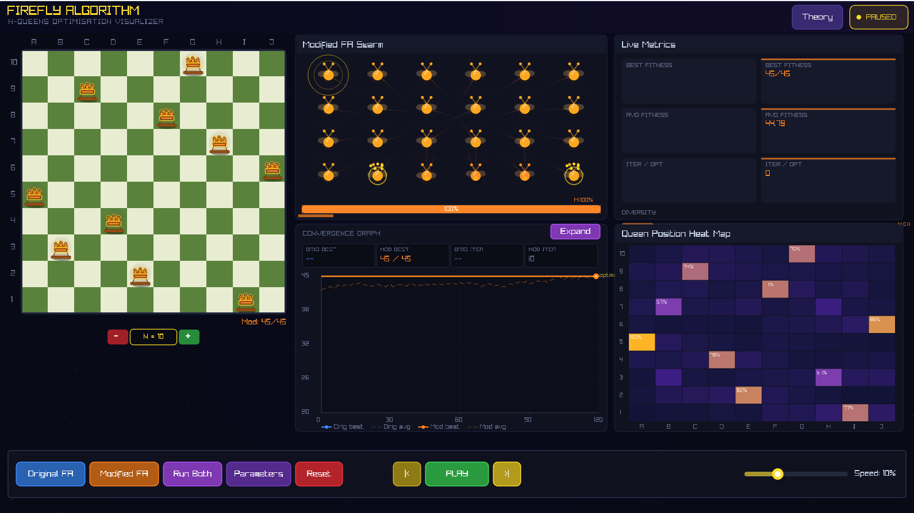
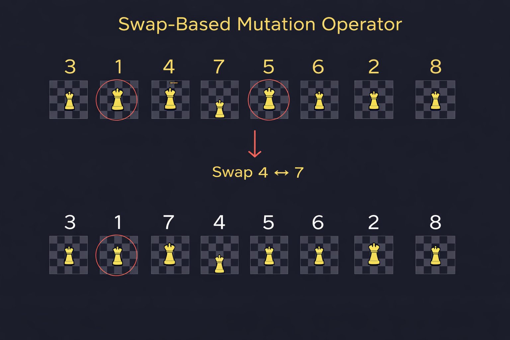
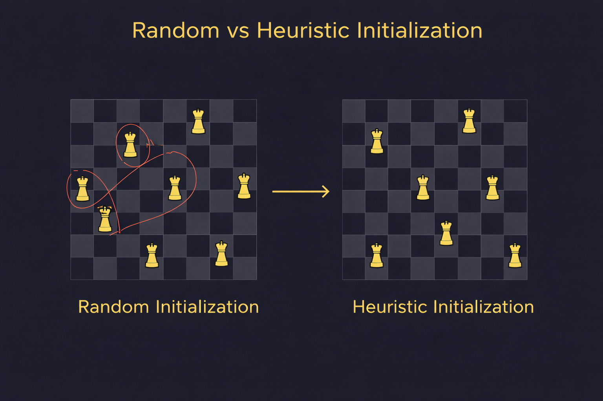
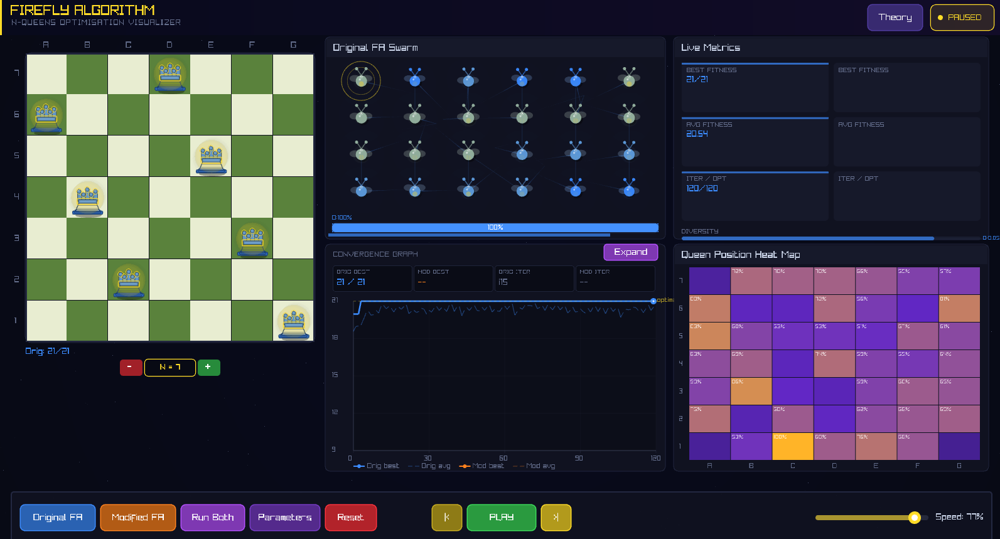
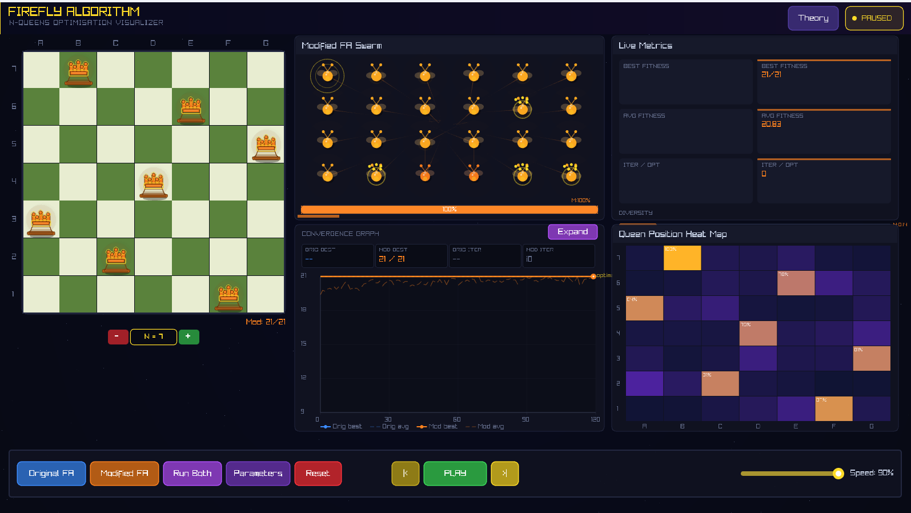
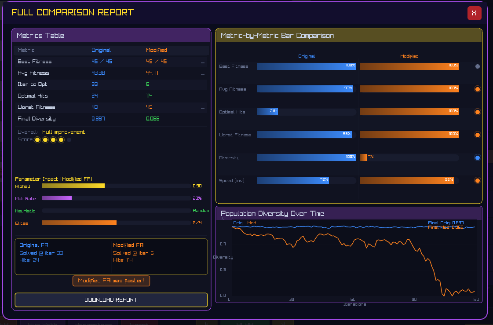
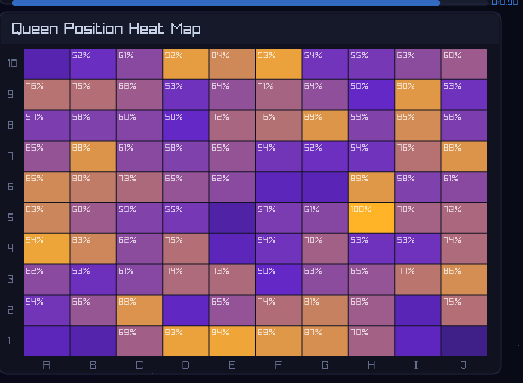
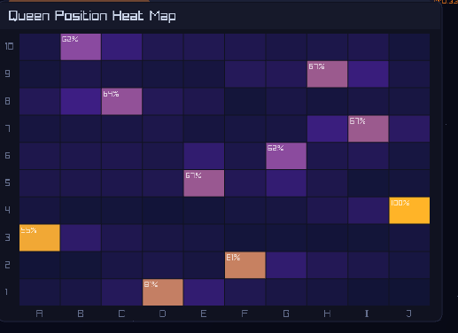
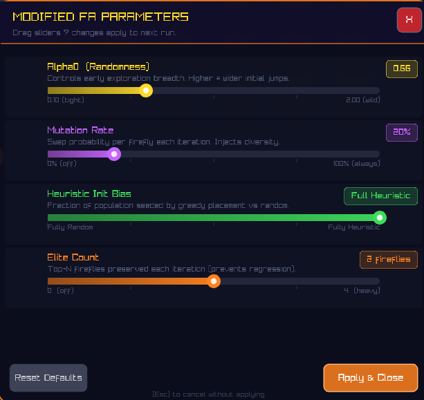

<div align="center">

# N-Queens Solver: Enhanced Firefly Algorithm

A nature-inspired metaheuristic approach to solving the N-Queens combinatorial optimization problem,
with real-time interactive visualization built using C++ and Raylib.


**[Watch Demo Video](https://youtu.be/i7nFv_LEdwM)**

</div>

---

## Overview

This project presents the design, implementation, and analysis of an enhanced Firefly Algorithm (FA)
for solving the N-Queens problem. The Firefly Algorithm, inspired by the bioluminescent
communication behavior of fireflies, serves as the base metaheuristic. Candidate solutions
iteratively move toward brighter (higher-fitness) solutions through an attractiveness function
and randomized perturbations.

The standard algorithm is augmented with several problem-specific modifications — including
adaptive randomness, swap-based mutation, heuristic initialization, and elitism — to significantly
improve convergence speed, solution quality, and robustness on this discrete combinatorial domain.

A full-featured real-time visualization system allows users to observe swarm dynamics, track
fitness evolution, and interactively tune algorithm parameters.



---

## Table of Contents

1. [Problem Statement](#problem-statement)
2. [Algorithm](#algorithm)
3. [Solution Representation](#solution-representation)
4. [Modifications and Enhancements](#modifications-and-enhancements)
5. [Visualization System](#visualization-system)
6. [Results and Analysis](#results-and-analysis)
7. [Tech Stack](#tech-stack)
8. [Getting Started](#getting-started)
9. [Usage](#usage)
10. [Project Structure](#project-structure)
11. [References](#references)

---

## Problem Statement

The N-Queens problem requires placing N non-attacking queens on an N×N chessboard such that no
two queens share the same row, column, or diagonal. The number of valid configurations grows
combinatorially with N, making exhaustive and deterministic approaches computationally
infeasible for large board sizes.

Traditional backtracking methods guarantee correctness but scale poorly. This project addresses
the need for an efficient heuristic solver that:

- Handles large search spaces effectively through population-based search
- Adapts the continuous Firefly Algorithm to a discrete permutation domain
- Provides an interactive, visual platform for understanding algorithm behavior

---

## Algorithm

### The Firefly Algorithm

The Firefly Algorithm (FA) is a swarm intelligence method developed by Xin-She Yang. Each
firefly in the swarm represents a candidate solution. Its brightness is proportional to solution
quality (fitness). Fireflies are attracted to brighter neighbors, and this attraction drives the
collective search toward optimal regions of the solution space.

The three governing principles are:

| Principle | Description |
|---|---|
| Universality | Any firefly can be attracted to any other, regardless of type |
| Attractiveness | Proportional to brightness; decreases with increasing distance |
| Randomization | A firefly with no brighter neighbor moves randomly |

### Mathematical Foundation

The **attractiveness function** decreases with distance `r` as:

```
beta(r) = beta_0 * exp(-gamma * r^2)
```

The **movement update** for firefly `i` attracted to brighter firefly `j` is:

```
x_i = x_i + beta(r_ij) * (x_j - x_i) + alpha * (rand - 0.5)
```

Where `beta` controls attractiveness, `alpha` controls randomness, and `rand` is drawn
uniformly from `[0, 1]`.

The **Euclidean distance** between two fireflies is:

```
r_ij = sqrt( sum_k (x_ik - x_jk)^2 )
```

---

## Solution Representation

Each firefly encodes a board configuration as a **permutation vector** of length N:

- The **index** of the vector represents the row on the chessboard.
- The **value** at each index represents the column position of the queen in that row.

This representation inherently satisfies the one-queen-per-row and one-queen-per-column
constraints. Only diagonal conflicts need to be evaluated during fitness computation.

**Fitness Function:**

```
Max Pairs = N * (N - 1) / 2
Conflicts = count of pairs (i, j) where |pos[i] - pos[j]| == |i - j|
Fitness   = Max Pairs - Conflicts
```

A fitness equal to `Max Pairs` indicates a valid, conflict-free solution.

---

## Modifications and Enhancements

The standard Firefly Algorithm operates on continuous domains. Five targeted modifications
adapt it to the discrete N-Queens search space and improve its overall performance.

### 1. Adaptive Randomness

In the standard FA, the randomness parameter `alpha` is fixed, causing either excessive
exploration or premature exploitation. In this implementation, `alpha` is reduced gradually
over iterations according to a decay schedule:

```
alpha(t) = alpha_initial * decay^t
```

This allows the algorithm to explore broadly in early iterations and refine solutions
in later stages.

### 2. Swap-Based Mutation

Continuous perturbation cannot be applied directly to permutation vectors without
violating constraints. Instead, a discrete **swap mutation** operator is used:

- Two distinct positions in the solution vector are selected at random.
- Their values are exchanged.

This preserves the permutation structure while introducing controlled diversity.
The mutation rate is user-configurable from the visualization interface.



### 3. Heuristic Initialization

Rather than relying entirely on random permutations, a fraction of the initial population
is seeded using a **greedy heuristic placement strategy** that minimizes diagonal conflicts
row by row. The remainder is initialized randomly. This hybrid approach provides a higher
quality starting distribution without sacrificing diversity.



### 4. Elitism

A fixed number of the best-performing fireflies are identified at the end of each
iteration and carried forward to the next generation without modification. This prevents
stochastic updates from overwriting high-quality solutions and accelerates convergence.

### 5. Repair Mechanism

The FA movement equation applied to integer-valued vectors can produce duplicate or
out-of-range column values, invalidating the permutation. A **repair function** restores
validity by:

1. Identifying duplicated column values in the updated vector.
2. Determining which values are missing from the valid range `[0, N-1]`.
3. Substituting duplicates with missing values in a deterministic order.

### 6. Stagnation Detection

If the best fitness value does not improve over a configurable number of consecutive
iterations, a **partial reinitialization** is triggered: a subset of the non-elite
population is replaced with new randomly or heuristically generated fireflies. This
mechanism restores diversity and helps the swarm escape local optima.

---

## Visualization System

The application provides a fully interactive simulation and analysis environment.

| Component | Description |
|---|---|
| Chessboard Display | Renders the current best solution in real time with conflict highlighting |
| Fitness Convergence Graph | Plots best, average, and worst fitness across iterations |
| Heatmap | Shows the frequency distribution of queen placements across all iterations |
| Comparison Mode | Runs Original FA and Modified FA simultaneously with side-by-side metrics |
| Parameter Panel | Sliders for N, population size, alpha, mutation rate, heuristic ratio, and elitism |

All parameters can be adjusted before or during a simulation run, enabling rapid
experimentation with algorithm behavior.

---

## Results and Analysis

### Convergence Comparison (N = 7)

The modified algorithm consistently reaches the optimal fitness in significantly fewer
iterations than the standard FA. The convergence curve is smoother and more monotonic,
reflecting the stabilizing effect of elitism and adaptive randomness.

| Metric | Original FA | Modified FA |
|---|---|---|
| Convergence Rate | Slow, irregular | Fast, smooth |
| Solution Consistency | Variable | High |
| Search Space Coverage | Narrow | Broad |
| Average Population Fitness | Lower | Consistently higher |

**Original Firefly Algorithm — N = 7**



**Modified Firefly Algorithm — N = 7**



**Side-by-Side Comparison Report**



### Heatmap Analysis

The heatmaps below visualize how frequently each board cell is occupied across all
iterations. The original algorithm tends to concentrate density in a limited region,
indicating premature convergence. The modified algorithm explores the space more broadly
before settling.

| Original FA | Modified FA |
|---|---|
|  |  |

### Parameter Sensitivity

The interactive parameter tuning interface allows direct experimentation with mutation
rate, alpha decay, heuristic ratio, and elitism count. Results show that moderate
elitism combined with a decaying alpha and a non-zero mutation rate produces the best
convergence profile.



---

## Tech Stack

| Component | Technology |
|---|---|
| Language | C++17 |
| Graphics and UI | [Raylib 5.x](https://www.raylib.com/) |
| Compiler | GCC / MinGW-w64 |
| Build System | Manual compilation |
| Target Platforms | Windows, Linux |

---

## Getting Started

### Prerequisites

Before compiling and running the project, ensure the following are installed on your system:

- **GCC / MinGW-w64** — C++ compiler with C++17 support
  - Windows: Download from [winlibs.com](https://winlibs.com/) or install via [MSYS2](https://www.msys2.org/)
  - Linux: `sudo apt install build-essential`

- **Raylib** — Graphics and windowing library
  - Follow the [official Raylib installation guide](https://github.com/raysan5/raylib/wiki) for your platform
  - Windows users can download prebuilt binaries from the [Raylib releases page](https://github.com/raysan5/raylib/releases)

---

### Step-by-Step Setup and Run Guide

**Step 1 — Clone the repository**

```bash
git clone https://github.com/Siddh-456/Firefly-Visualization.git
cd Firefly-Visualization
```

**Step 2 — Verify Raylib is installed**

On Windows, confirm that you have the Raylib include/library directories available.
A typical MinGW installation has them at:

```
C:\raylib\src\        (headers)
C:\raylib\src\        (libraylib.a)
```

Adjust the paths in the compile command below to match your installation.

**Step 3 — Compile the source**

Windows (MinGW):

```bash
g++ nqueen.cpp -o nqueen.exe -I"C:\raylib\src" -L"C:\raylib\src" -lraylib -lopengl32 -lgdi32 -lwinmm -std=c++17
```

Linux:

```bash
g++ nqueen.cpp -o nqueen -lraylib -lGL -lm -lpthread -ldl -lrt -lX11 -std=c++17
```

**Step 4 — Run the executable**

Windows:

```bash
./nqueen.exe
```

Linux:

```bash
./nqueen
```

**Step 5 — Use the visualizer**

Once the window opens:
- Adjust the N slider to set the board size (e.g. 7, 8, 10)
- Set population size, mutation rate, and other parameters using the sliders
- Click **Start** to begin the simulation
- Switch to **Compare Mode** to run Original FA and Modified FA side by side
- Observe the convergence graph and heatmap updating in real time

---

## Usage

| Control | Function |
|---|---|
| N slider | Set the board size (number of queens) |
| Population slider | Set the swarm size |
| Alpha slider | Set the initial randomness parameter |
| Mutation Rate | Control probability of swap mutation per firefly |
| Heuristic Ratio | Fraction of population initialized heuristically |
| Elitism Count | Number of elite fireflies preserved each generation |
| Start / Reset | Begin or restart the simulation |
| Compare Mode | Run Original FA and Modified FA in parallel |

---

## Project Structure

```
Firefly-Visualization/
|-- nqueen.cpp               # Main source file (Enhanced Firefly Algorithm + Visualizer)
|-- images/
|   |-- visualizer_main.png
|   |-- orig_fa_n7.png
|   |-- mod_fa_n7.png
|   |-- comparison_report.png
|   |-- heatmap_orig.png
|   |-- heatmap_mod.png
|   |-- param_tuning.png
|   |-- heuristic_init.png
|   `-- swap_mutation.png
`-- README.md
```

---

## References

1. X.-S. Yang, "Firefly Algorithm, Stochastic Test Functions and Design Optimisation,"
   *International Journal of Bio-Inspired Computation*, vol. 2, no. 2, pp. 78–84, 2010.

2. GeeksforGeeks, "N-Queen Problem — Backtracking Approach,"
   https://www.geeksforgeeks.org/n-queen-problem/

3. Raylib, "Official Documentation and API Reference,"
   https://www.raylib.com/

4. IEEE Xplore Digital Library — Metaheuristic optimization and swarm intelligence research.
